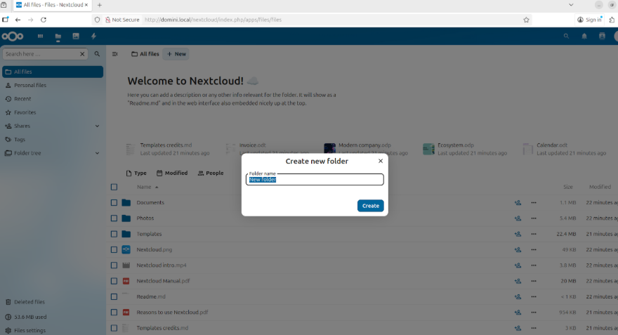
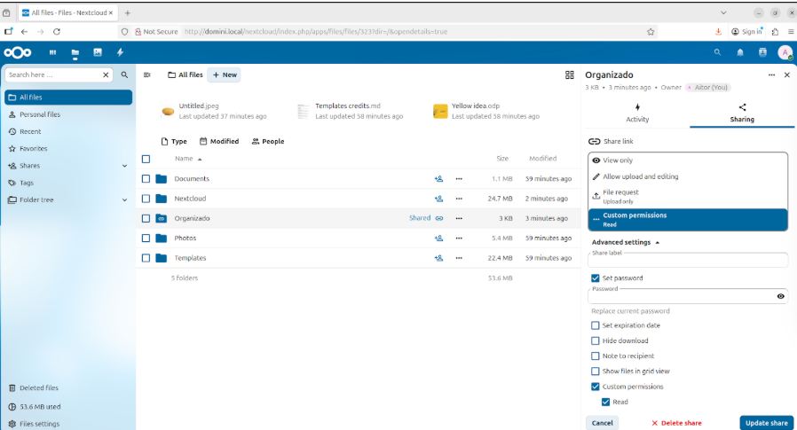
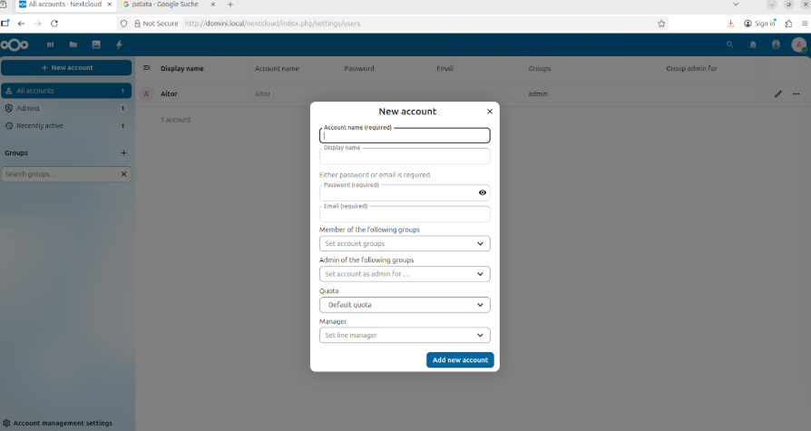

# CONFIGURACIÓN NEXTCLOUD

## 1. Demostración del funcionamiento:

- Para subir imagenes o documentos a la nube tendrás que entrar al apartado de tus archivos y desde ahi te saldra la opción de "New", y desde ahi podrás agregar cualquier imagen o documento que desees.
- Lo mismo para crear carpetas, en la opción de "New" podrás crear carpetas

- Si quieres generar enlaces y compartir fitxeros con otros usuarios deberás seleccionar aquello que quieras compartir y darle a los tres puntos "..." ahi tendrás la opción de compartir ("Share") y a continuación en la
imagen mostraré las opciones que te aparecen:

## 2. Crear usuarios:

- Para crear usuarios dentro de NextCloud tienes que acceder al apartado de "All accounts" accediendo a este desde tu perfil, a continuación te aparecerá el apartado de "New account", ahi podrás crear tu usuario con sus permisos por rol, añadirlos a grupos especificos, etc...

## 3. Administración de archivos:

- Dentro del apartado de "All files" en tu NextCloud, podrás seleccionar varios archivos a la misma vez, cuando hayas seleccionado aquellos que quieres organizar, ya séan carpetas o archivos podrás crear una jerarquia lógica para todos estos.

